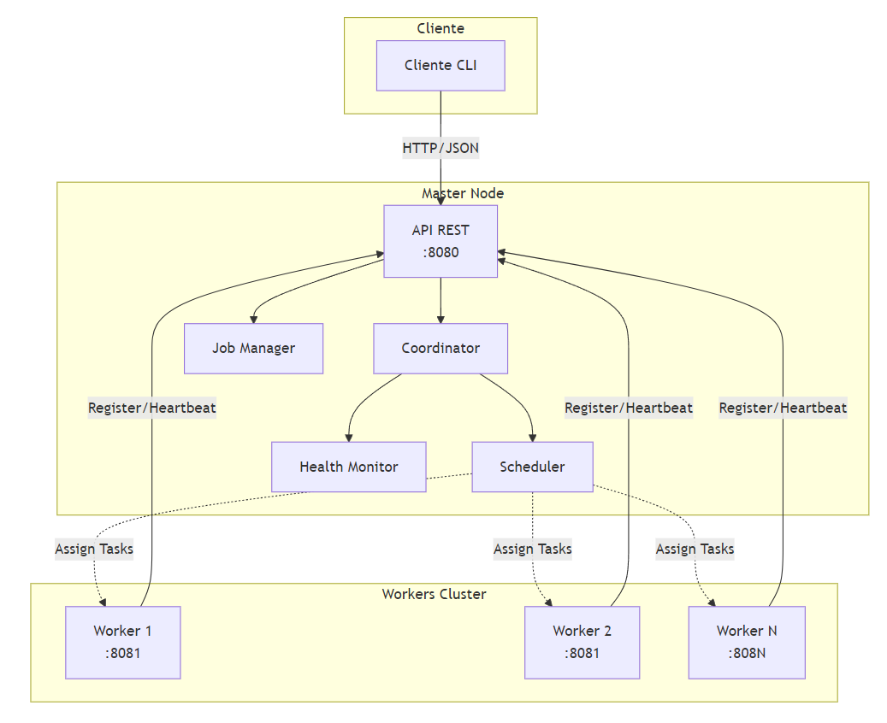
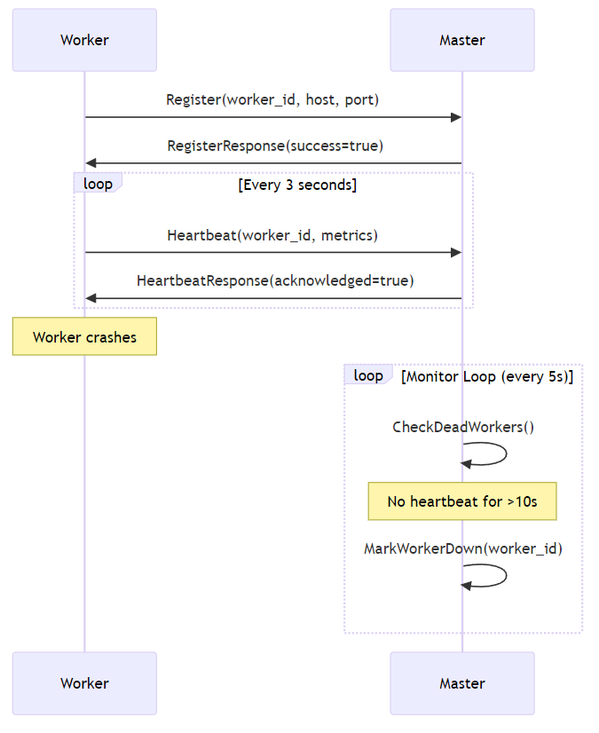
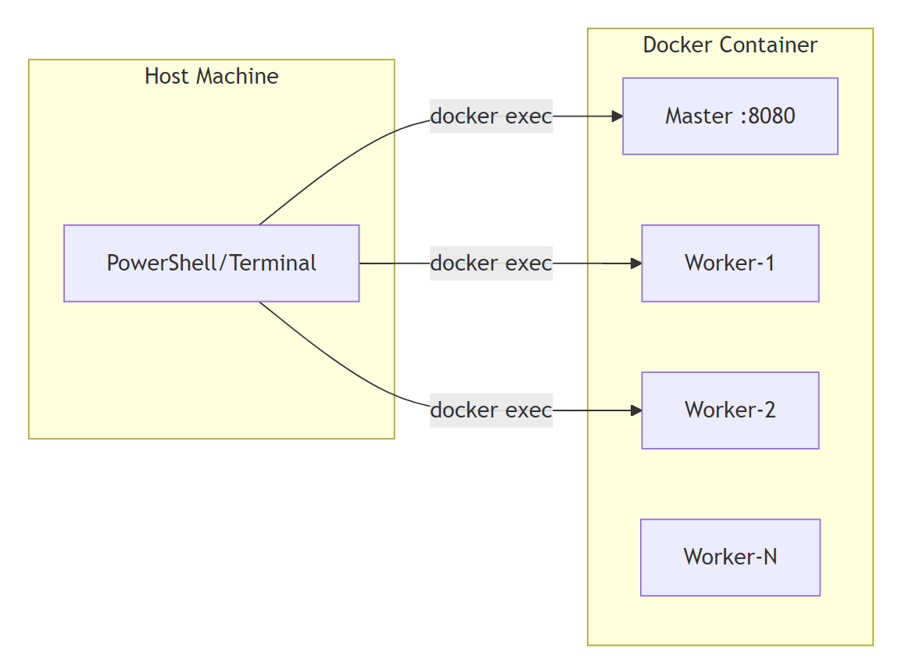
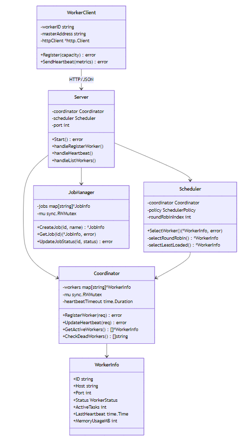
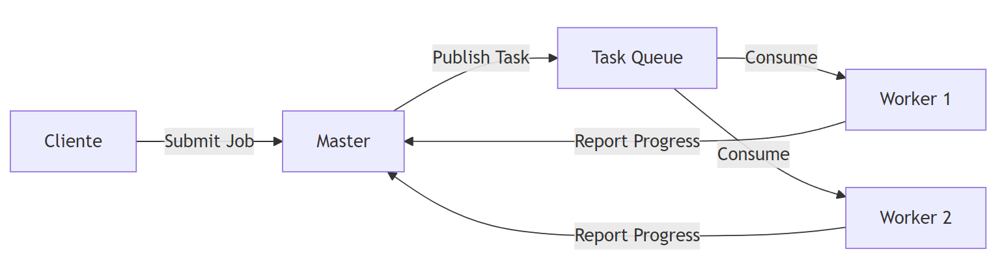
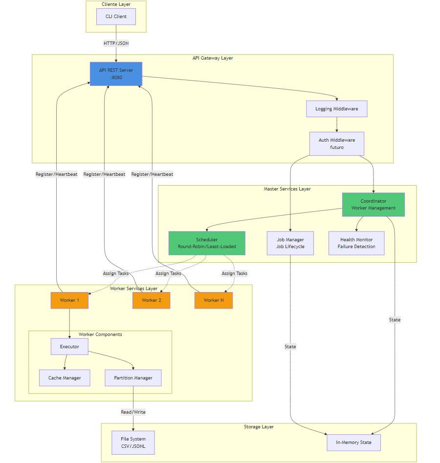
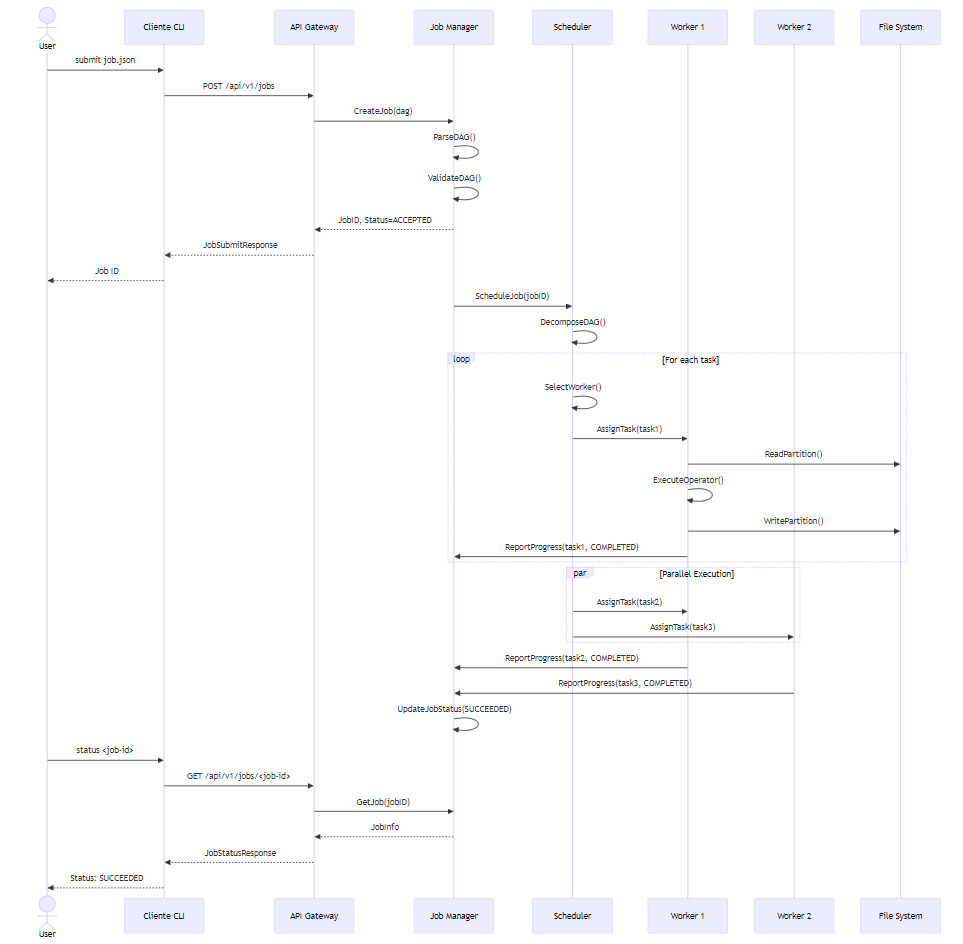

# Documento de Arquitectura - Mini-Spark
## Proof of Concepts
### PoC Diagrama de Arquitectura General


### PoC Paso 1: Componentes Principales 
El sistema está diseñado siguiendo una arquitectura Master-Worker distribuida, donde cada componente tiene responsabilidades claramente definidas:

- Master/Coordinator: Gestiona el registro de workers, monitorea su estado mediante heartbeats, y coordina la distribución de tareas.
- Workers: Se auto-registran con el master al iniciar, ejecutan tareas asignadas, y reportan su estado periódicamente.
- API REST: Expone endpoints para registro de workers, heartbeats, envío de jobs y consulta de estado.
- Scheduler: Implementa políticas de planificación (Round-Robin, Least-Loaded) para asignar tareas a workers disponibles.

Esta separación asegura que cada componente tenga una única responsabilidad (Single Responsibility Principle) y permita escalabilidad horizontal.

### PoC Paso 2: Sistema de Comunicación IPC
La comunicación entre componentes utiliza HTTP/JSON como protocolo principal:

- Workers -> Master: Registro inicial y heartbeats periódicos cada 3 segundos
- Master -> Workers: Asignación de tareas 
- Cliente -> Master: Envío de jobs y consulta de estado

Ventajas del enfoque HTTP/JSON:

- No requiere librerías adicionales (solo stdlib de Go)
- Protocolo stateless ideal para sistemas distribuidos
- Fácil debugging y testing con herramientas como curl
- Compatible con despliegue en contenedores Docker

### PoC Paso 3: Tolerancia a Fallos
El sistema implementa detección automática de fallos mediante:

- Heartbeat Monitoring: Workers envían señales cada 3 segundos
- Timeout Detection: Master marca workers como DOWN si no recibe heartbeat en 10 segundos
- Status Tracking: Estado persistente (ACTIVE/DOWN) para cada worker



### PoC Paso 4: Patrones de Diseño Implementados

#### Strategy Pattern - Scheduler:

``` go
type SchedulerPolicy string

const (
    PolicyRoundRobin  SchedulerPolicy = "round-robin"
    PolicyLeastLoaded SchedulerPolicy = "least-loaded"
)

type Scheduler struct {
    policy SchedulerPolicy
    // ...
}

func (s *Scheduler) SelectWorker() (*WorkerInfo, error) {
    switch s.policy {
    case PolicyRoundRobin:
        return s.selectRoundRobin(workers), nil
    case PolicyLeastLoaded:
        return s.selectLeastLoaded(workers), nil
    }
}

```

#### Singleton Pattern - Coordinator:
El Coordinator mantiene un único estado global de workers con acceso thread-safe mediante `sync.RWMutex.`

#### Factory Pattern - Preparado para futuros operadores:
TODO
La estructura modular permite implementar factories para operadores DAG (map, filter, reduce, join).

### PoC Paso 5: Deployment & Testing
#### Arquitectura de Despliegue:


## Backend Architecture
### 1. Arquitectura del Sistema
**Tipo de Arquitectura:** Microservicios Distribuidos con Coordinación Centralizada

El sistema sigue un modelo Master-Worker donde:
- El Master actúa como coordinador central y punto de entrada API
- Los Workers son nodos de procesamiento independientes y escalables
- La comunicación es stateless mediante HTTP/JSON

**Justificación:**

- Escalabilidad: Workers pueden agregarse/removerse dinámicamente
- Tolerancia a Fallos: Detección automática de nodos caídos
- Simplicidad: No requiere librerías externas complejas 
- Flexibilidad: Preparado para procesamiento batch DAG según especificaciones

**Internal Layers and Object Design**

El backend está estructurado en las siguientes capas internas:

**API Layer:** Punto de entrada HTTP, maneja routing y validación de requests
``` go
// internal/api/server.go
type Server struct {
    coordinator *master.Coordinator
    scheduler   *master.Scheduler
    port        int
}
```
**Coordination Layer:** Gestiona estado de workers y asignación de tareas
``` go
// internal/master/coordinator.go
type Coordinator struct {
    workers          map[string]*WorkerInfo
    mu               sync.RWMutex
    heartbeatTimeout time.Duration
}
```

**Worker Layer:** Ejecuta tareas y reporta estado
``` go
// internal/worker/client.go
type Client struct {
    workerID      string
    masterAddress string
    httpClient    *http.Client
}
```

**Protocol Layer:** Define contratos de comunicación
``` go
// internal/protocol/messages.go
type WorkerRegisterRequest struct {
    WorkerID   string
    Host       string
    Port       int
    Capacity   int
}
```

**Diagrama de Clases**



### 2. Infraestructura

Se utliza una infrastructura simple contenerizada por medio de Docker, que tiene capacidad para utilizarse en Cloud. Actualmente se utiliza Docker Compose para orquestación local, pero a futuro si se quisiera se podría implementar la misma infrastructura en un Cluster AWS ECS con Fargate o Kubernetes. 

### 3. Microservicios
Modelo: Microservicios distribuidos con coordinación centralizada

**Microservicios Implementados:**

**1. Master Service (Coordinador)**

- Registro y monitoreo de workers
- Planificación de tareas
- Gestión de jobs
- API REST pública

**2. Worker Service (Procesamiento)**

- Ejecución de tareas DAG
- Reporte de métricas
- Auto-registro con master

**3. Client Service (CLI)**
- Interfaz de línea de comandos
- Envío de jobs
- Consulta de estado

**Organización del Código:**
``` text
├───cmd
│   ├───client
│   ├───master
│   └───worker
├───data
│   ├───input
│   └───output
├───deployment
│   └───config
├───docs
│   └───img
├───internal
│   ├───api
│   ├───common
│   ├───dag
│   ├───master
│   ├───monitoring
│   ├───operators
│   ├───protocol
│   ├───storage
│   └───worker
├───scripts
└───test
    ├───e2e
    ├───integration
    └───unit
```

### 4. Event-Driven Architecture
Para la ejecución de tareas DAG, se implementará un modelo event-driven:


## Diseño de Arquitectura
### Diagrama de Arquitectura Completo


### Flujo de Ejecución de un Job

